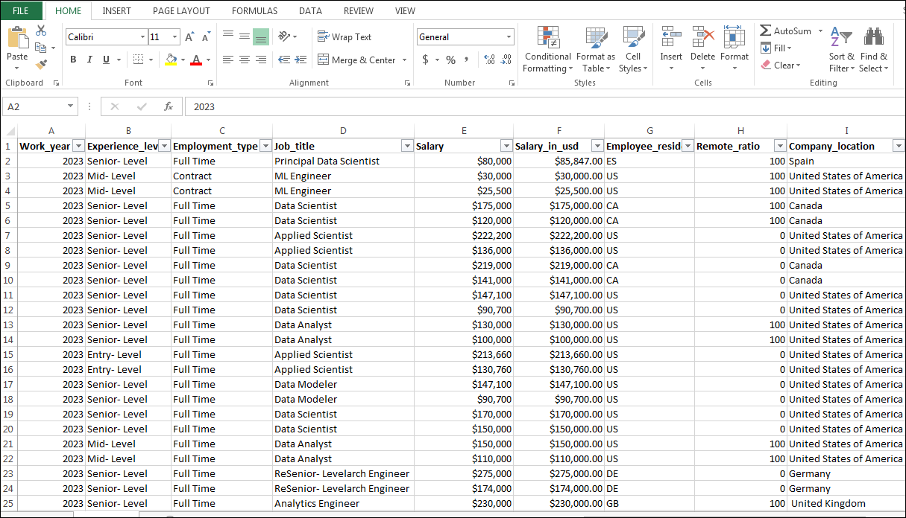
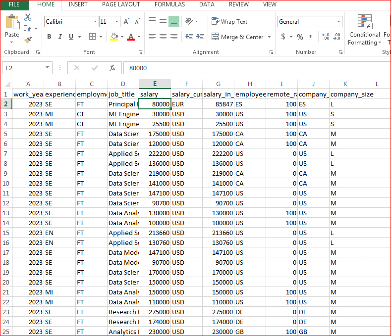
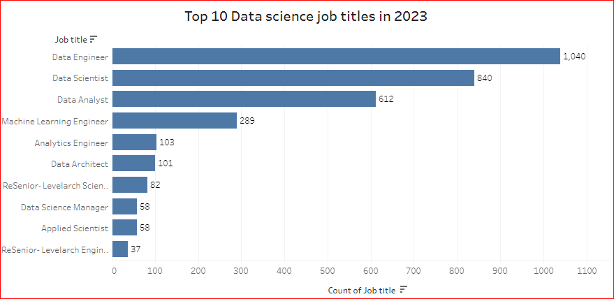
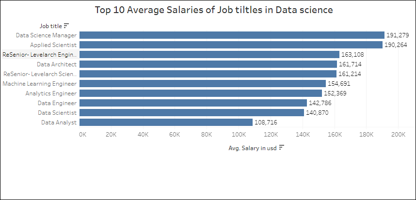
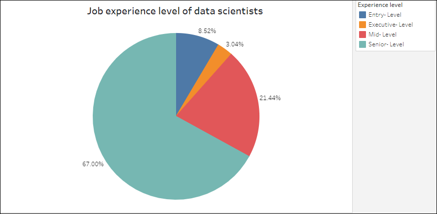
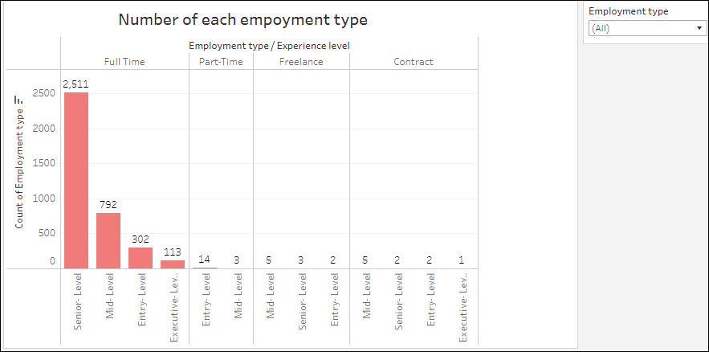
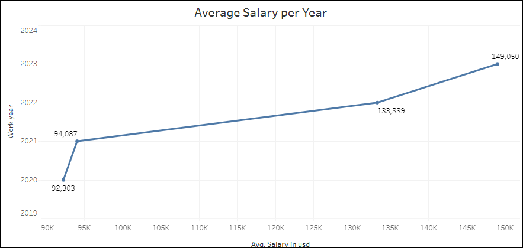
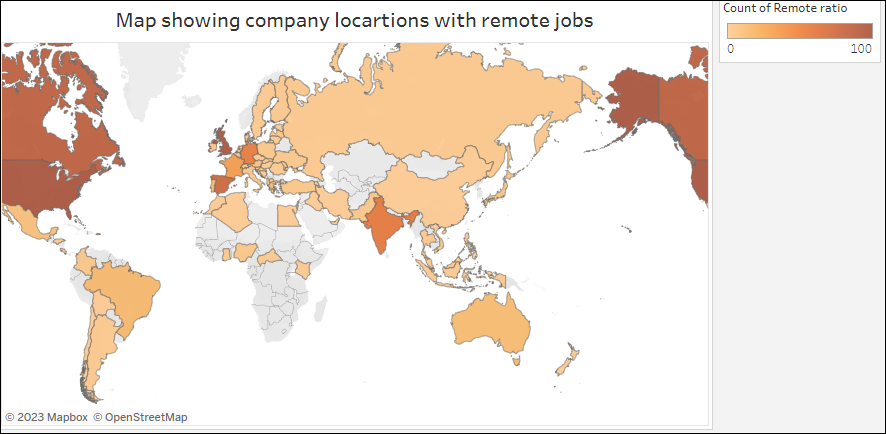

# Analysis of Data Science Professionals' Salaries in 2023

---

# Introduction:
So, I was so curious about how much different job roles in data science make! I mean, there are data engineers, data analysts, and of course, the rockstar number-crunchers - data scientists! So I just had to look up data and compare their salaries to see who's making the most bank.

In this project, I will be conducting a comprehensive exploratory data analysis and visualization of the dataset to uncover hidden patterns, relationships, and insights that can inform salary negotiations and career decisions in the field of data science.

### Concepts Applied:
1.	Data cleaning
2.	Descriptive statistics
3. EDA

# Data Sourcing
The dataset was downloaded from kaggle [here](https://www.kaggle.com/datasets/arnabchaki/data-science-salaries-2023). 

It contains 11 columns, each are:
- work_year: The year the salary was paid.
- experience_level: The experience level in the job during the year
- employment_type: The type of employment for the role
- job_title: The role worked in during the year.
- salary: The total gross salary amount paid.
- salary_currency: The currency of the salary paid as an ISO 4217 currency code.
- salaryinusd: The salary in USD
- employee_residence: Employee's primary country of residence in during the work year as an ISO 3166 country code.
- remote_ratio: The overall amount of work done remotely
- company_location: The country of the employer's main office or contracting branch
- company_size: The median number of people that worked for the company during the year

# Problem statement 
1. What are Top 10 Data science job titles in 2023?
2.	Which data science Job titles earn the top salaries?
3.	Which is the top experience level of data scientists in 2023?
4.	What types of employment arrangements are common in this field?
5.  What year has Data Scientists earned the highest?
8.	Where are the top remote jobs locations?

# Data Cleaning
   Cleaned data            |     Raw data
   :----------------------:|:---------------:
    | 
   
   ##### Tasks carried out are:-
- Made the first row as header and capitalizing the first word for easy readability
- I changed data type from General to **Text**, **Currency** and **Number** where applicable
- I standardized abbreviations using Find/Replace 
- filtered the data to meet certain conditions and checked for blanks
- Deleted the salary currency column sincce we already have a column that has the salries in US dollars
- Standardized the company location column by replacing the country-names abrreviations, so as to ensure accuracy and consitencies.

# Data Analysis and Visualization
 Top data science job titles in 2023           |    Data science job titles earning top salaries
   :----------------------:|:---------------:
    | 
   #### Insights:
   1. In terms of job titles, data engineers have the highest position, with data scientists following closely behind.
   2. As anticipated, employees at the executive level typically receive higher average salaries. Additionally, the profession of cloud data architect has become the second highest paid due to the increasing prevalence of cloud computing.
  ---
  
   Experience level of data scientists in 2023   |     Common types of employment arrangements in Data science 
   :-----------------------------------------:|:-----------------------:
                       | 
   
   #### Insights:
    1. The data shows that senior-level positions have the highest count accounting for 67% of the whole , then followed by mid-level positions, while executive-level positions are comparatively fewer.
    2. The data indicates that a significant number of individuals are employed on a full-time basis, with the majority of them holding senior positions. Furthermore, it appears that freelancing has become less common in recent times.
---
   
  Average salary from 2020 - 2023    |     Map of country location with remote jobs in Data science 
   :-----------------------------------------:|:-----------------------:
                     | 
  
     
   #### Insight:
   1. The data clearly shows that the average salary for data-driven jobs has been on the rise every year, with a notably significant increase observed between 2021 and 2022. This trend highlights the escalating need for qualified and competent professionals in this field.
   2. United States is the country with the highest remote ratio. You could hover [**here**] around other countries to gain more location insights
  
   

